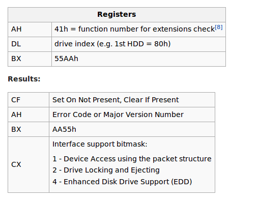
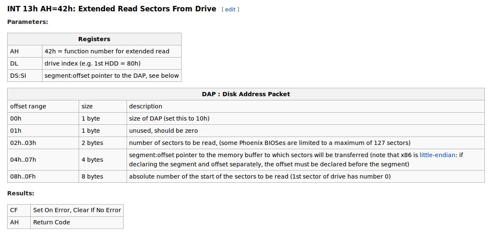

# MBR\(Master Boot Record\)

# _What is MBR?_

MBR\(Master Boot Record\) is part of grub2, the hardware of hour emulator is i386, the code of MBR located in directory `grub-core/boot/i386/pc/boot.S`,  it installed in the first sector of disk image, after BIOS initialized, MBR loaded to memory at address 0x7c00.

We will not discuss what happen after you push power button and BIOS initialization, you can reference [linux-inside](https://www.gitbook.com/book/0xax/linux-insides/details) if you have instresting for this part.

Memory deployment of address 0x7c00 length 512:

```shell
0x7c00          +----------------------+
   446 bytes    | Boot Loader          |
                |                      |
                |                      |
                |                      |
                +----------------------+
   64 bytes     | Partition Table      |
                |                      |
                +----------------------+
   2 bytes      | Magic Signature      |
                +----------------------+
```

Part of assembly code of MBR:`grub-core/boot/i386/pc/boot.S`

```assembly
.globl _start, start;
_start:
start:
 /*
 * _start is loaded at 0x7c00 and is jumped to with CS:IP 0:0x7c00
 */

 /*
 * Beginning of the sector is compatible with the FAT/HPFS BIOS
 * parameter block.
 */

 jmp LOCAL(after_BPB)


....


 /*
 * This is where an MBR would go if on a hard disk. The code
 * here isn't even referenced unless we're on a floppy. Kinda
 * sneaky, huh?
 */
 . = _start + GRUB_BOOT_MACHINE_PART_START


...


 . = _start + GRUB_BOOT_MACHINE_PART_END

/* the last 2 bytes in the sector 0 contain the signature */
 .word GRUB_BOOT_MACHINE_SIGNATURE
```

MACROs used in above assembly code:`include/grub/i386/pc/boot.h`

```
#define GRUB_BOOT_MACHINE_PART_START 0x1be
#define GRUB_BOOT_MACHINE_PART_END   0x1fe
#define GRUB_BOOT_MACHINE_SIGNATURE  0xaa55
```

The boot signature of MBR must be 0xaa55, otherwise the signature checking will be failed when loading MBR to memory. Below code is a sample of simple MBR, it's used to verify boot signature.

test\_boot\_signature\_only.S

```
.code16                #Generate 16bits real mode code
.text                #Code section

    .global _start;        #Code entry
_start:
    #Print 'H'
    movb $'H', %al
    movb $0x0e, %ah
    int $0x10

    #Print 'e'
    movb $'e', %al
    movb $0x0e, %ah
    int $0x10

    #Print 'l'
    movb $'l', %al
    movb $0x0e, %ah
    int $0x10

    #Print 'l'
    movb $'l', %al
    movb $0x0e, %ah
    int $0x10

    #Print 'o'
    movb $'o', %al
    movb $0x0e, %ah
    int $0x10

    #Print ','
    movb $',', %al
    movb $0x0e, %ah
    int $0x10

    #Print ' '
    movb $' ', %al
    movb $0x0e, %ah
    int $0x10

    #Print 'W'
    movb $'W', %al
    movb $0x0e, %ah
    int $0x10

    #Print 'o'
    movb $'o', %al
    movb $0x0e, %ah
    int $0x10

    #Print 'r'
    movb $'r', %al
    movb $0x0e, %ah
    int $0x10

    #Print 'l'
    movb $'l', %al
    movb $0x0e, %ah
    int $0x10

    #Print 'd'
    movb $'d', %al
    movb $0x0e, %ah
    int $0x10

    #Print '!'
    movb $'!', %al
    movb $0x0e, %ah
    int $0x10

    .byte 0x55        #boot signature
    .byte 0xaa        #boot signat
```

Compile the assembly code:

```
as test_boot_signature_only.S -o test_boot_signature_only.o
```

Link the object file, instruct link to map MBR at address 0x7c00

```
ld -Ttext 0x7c00 --oformat=binary test_boot_signature_only.o -o test_boot_signature_only.bin
```

Create a flopy and copy the executable code to it

floppy\_creator.sh

```
#!/bin/bash


if [[ $1 == "" ]]
then
    echo "Select executable please!!"
    exit 1
fi

# To create a floppy disk image to 1.4mb size
dd if=/dev/zero of=floppy.img bs=512 count=2880

# To copy the code to the boot sector of the floppy disk image file
dd if=$1 of=floppy.img#!/bin/bash


if [[ $1 == "" ]]
then
    echo "Select executable please!!"
    exit 1
fi

# To create a floppy disk image to 1.4mb size
dd if=/dev/zero of=floppy.img bs=512 count=2880

# To copy the code to the boot sector of the floppy disk image file
dd if=$1 of=floppy.img
```

With qemu to boot from floppy

```
qemu-system-i386 -fda floppy.img -boot a
```

The expect result


If boot signature is not \`0x55aa\`, let's check the result again


After failed to boot from floppy because of the failure when checking boot signature, qemu tried to boot from DVD/CD, etc ... until it found no bootable device.

## _What does MBR do?_

Source code of MBR copies grub kernel to specifid address and jump to it to continue the boot process

BIOS loads MBR to memory address 0x7c00, the first instruction is jump to 0x7c65 `jmp    LOCAL(after_BPB)`.

```
0x7c00: jmp 0x7c65
```

Between 0x7c00 and 0x7c65, there are BIOS parameter block and other parameters stored.

```
    jmp    LOCAL(after_BPB)
    nop    /* do I care about this ??? */

    /*
     * This space is for the BIOS parameter block!!!!  Don't change
     * the first jump, nor start the code anywhere but right after
     * this area.
     */

    . = _start + GRUB_BOOT_MACHINE_BPB_START
    . = _start + 4

    /* scratch space */
mode:
    .byte    0
disk_address_packet:
sectors:
    .long    0
heads:
    .long    0
cylinders:
    .word    0
sector_start:
    .byte    0
head_start:
    .byte    0
cylinder_start:
    .word    0
    /* more space... */

    . = _start + GRUB_BOOT_MACHINE_BPB_END

    /*
     * End of BIOS parameter block.
     */

kernel_address:
    .word    GRUB_BOOT_MACHINE_KERNEL_ADDR

    . = _start + GRUB_BOOT_MACHINE_KERNEL_SECTOR
kernel_sector:
    .long    1, 0

    . = _start + GRUB_BOOT_MACHINE_BOOT_DRIVE
boot_drive:
    .byte 0xff    /* the disk to load kernel from */
            /* 0xff means use the boot drive */

LOCAL(after_BPB):
```

Contine the procedue after `jmp    LOCAL(after_BPB)`

MBR checks boot device type, BIOS saves boot device type in register `dl`, for HDD the register set as 0x80, 0x70 for floppy.  
Value of register `dl`\(0x80\) shown in following debug information, jump to 0x7c74. Of course if `dl` is 0x70, do nothing but jump to 0x7c74. Instruction at address 0x7c74 is a long jump to dest address 0x7c79 `ljmp    $0, $real_start`

```assembly
   0x7c65:    cli    
   0x7c66:    nop
   0x7c67:    nop
   0x7c68:    test   $0x80,%dl
(gdb) info registers dl
dl             0x80    -128
   0x7c6b:    je     0x7c72
   0x7c6d:    test   $0x70,%dl
   0x7c70:    je     0x7c74
   0x7c72:    mov    $0x80,%dl
   0x7c74:    ljmp   $0x0,$0x7c79
   0x7c79:    xor    %ax,%ax

----------------------------------------------------------------------

grub-core/boot/i386/pc/boot.S:99

LOCAL(after_BPB):

/* general setup */
        cli             /* we're not safe here! */

        /*
         * This is a workaround for buggy BIOSes which don't pass boot
         * drive correctly. If GRUB is installed into a HDD, check if
         * DL is masked correctly. If not, assume that the BIOS passed
         * a bogus value and set DL to 0x80, since this is the only
         * possible boot drive. If GRUB is installed into a floppy,
         * this does nothing (only jump).
         */
        . = _start + GRUB_BOOT_MACHINE_DRIVE_CHECK
boot_drive_check:
        jmp     3f      /* grub-setup may overwrite this jump */
        testb   $0x80, %dl
        jz      2f
3:
        /* Ignore %dl different from 0-0x0f and 0x80-0x8f.  */
        testb   $0x70, %dl
        jz      1f
2:
        movb    $0x80, %dl
1:
        /*
         * ljmp to the next instruction because some bogus BIOSes
         * jump to 07C0:0000 instead of 0000:7C00.
         */
        ljmp    $0, $real_start
```

Instrucstions start from 0x7c79 initialize data section register with 0 and initialize stack with address 0x2000, enable interrupt, check the value at address 0x7c64 which refers to `boot_drive`, let's check the defination of `boot_drive`again as follow

```
boot_drive:
    .byte 0xff    /* the disk to load kernel from */
            /* 0xff means use the boot drive */
```

the value stored in address 0x7c64 is 0xff as follow, next instruction is jump to 0x7c8c if value in 0x7c64 is equal to 0xff.

```assembly
   0x7c79:    xor    %ax,%ax
   0x7c7b:    mov    %ax,%ds
   0x7c7d:    mov    %ax,%ss
   0x7c7f:    mov    $0x2000,%sp
   0x7c82:    sti    
   0x7c83:    mov    0x7c64,%al
(gdb) x/b 0x7c64
0x7c64:    0xff
   0x7c86:    cmp    $0xff,%al
   0x7c88:    je     0x7c8c
   0x7c8a:    mov    %al,%dl
   0x7c8c:    push   %dx

----------------------------------------------------------------------

grub-core/boot/i386/pc/boot.S:130

real_start:

        /* set up %ds and %ss as offset from 0 */
        xorw    %ax, %ax
        movw    %ax, %ds
        movw    %ax, %ss

        /* set up the REAL stack */
        movw    $GRUB_BOOT_MACHINE_STACK_SEG, %sp

        sti             /* we're safe again */

        /*
         *  Check if we have a forced disk reference here
         */
        movb   boot_drive, %al
        cmpb    $0xff, %al
        je      1f
        movb    %al, %dl
```

Instructions start at address 0x7c8c and end at address 0x7c90 just print notification message to screen.

```
   0x7c8c:    push   %dx
   0x7c8d:    mov    $0x7d80,%si
(gdb) x/s 0x7d80
0x7d80:    "GRUB "
   0x7c90:    call   0x7daa
```

Next instrucstions check Extensions Present using BIOS interrupt `0x13`. The result shown in debug information. Check the returned result of BIOS routine, jump to 0x7cde `LOCAL(chs_mode)` if failed. The reference of BIOS interrupt `0x13`shown in following section.

```
   0x7c93:    mov    $0x7c05,%si
   0x7c96:    mov    $0x41,%ah
   0x7c98:    mov    $0x55aa,%bx
   0x7c9b:    int    $0x13
(gdb) info registers 
eax            0x3000    12288
ecx            0x7    7
edx            0x80    128
ebx            0xaa55    43605
esp            0x1ffe    0x1ffe
ebp            0x0    0x0
esi            0x7c05    31749
edi            0x0    0
eip            0x7c9d    0x7c9d
eflags         0x246    [ PF ZF IF ]
cs             0x0    0
ss             0x0    0
ds             0x0    0
es             0x0    0
fs             0x0    0
gs             0x0    0
   0x7c9d:    pop    %dx
   0x7c9e:    push   %dx
   0x7c9f:    jb     0x7cde
   0x7ca1:    cmp    $0xaa55,%bx
   0x7ca5:    jne    0x7cde
   0x7ca7:    and    $0x1,%cx
   0x7caa:    je     0x7cde
   0x7cac:    xor    %ax,%ax
   0x7cae:    mov    %ax,0x4(%si)
   0x7cb1:    inc    %ax
   0x7cb2:    mov    %al,-0x1(%si)
   0x7cb5:    mov    %ax,0x2(%si)
   0x7cb8:    movw   $0x10,(%si)

----------------------------------------------------------------------

grub-core/boot/i386/pc/boot.S:149

1:
        /* save drive reference first thing! */
        pushw   %dx

        /* print a notification message on the screen */
        MSG(notification_string)

        /* set %si to the disk address packet */
        movw    $disk_address_packet, %si

        /* check if LBA is supported */
        movb    $0x41, %ah
        movw    $0x55aa, %bx
        int     $0x13

        /*
         *  %dl may have been clobbered by INT 13, AH=41H.
         *  This happens, for example, with AST BIOS 1.04.
         */
        popw    %dx
        pushw   %dx

        /* use CHS if fails */
        jc      LOCAL(chs_mode)
        cmpw    $0xaa55, %bx
        jne     LOCAL(chs_mode)

        andw    $1, %cx
        jz      LOCAL(chs_mode)
```

INT 13h AH=41h: Check Extensions Present:  


OK, if no failure detected, we come to address 0x7cac`lba_mode`.

Instructions between 0x7cac and 0x7cce prepare DAP\(disk address packet\) , if remember correctly, the value of register `si` is 0x7c05, if you don't remeber it, go back to above section, we just print registers' information. DAP\(disk address packet\)  is used when reading sector data from disk.

```
   0x7cac:    xor    %ax,%ax
   0x7cae:    mov    %ax,0x4(%si)
   0x7cb1:    inc    %ax
   0x7cb2:    mov    %al,-0x1(%si)
   0x7cb5:    mov    %ax,0x2(%si)
   0x7cb8:    movw   $0x10,(%si)
   0x7cbc:    mov    0x7c5c,%ebx
   0x7cc1:    mov    %ebx,0x8(%si)
   0x7cc5:    mov    0x7c60,%ebx
   0x7cca:    mov    %ebx,0xc(%si)
   0x7cce:    movw   $0x7000,0x6(%si)

----------------------------------------------------------------------

grub-core/boot/i386/pc/boot.S:179

lba_mode:
        xorw    %ax, %ax
        movw    %ax, 4(%si)

        incw    %ax
        /* set the mode to non-zero */
        movb    %al, -1(%si)

        /* the blocks */
        movw    %ax, 2(%si)

        /* the size and the reserved byte */
        movw    $0x0010, (%si)

        /* the absolute address */
        movl    kernel_sector, %ebx
        movl    %ebx, 8(%si)
        movl    kernel_sector + 4, %ebx
        movl    %ebx, 12(%si)
        /* the segment of buffer address */
        movw    $GRUB_BOOT_MACHINE_BUFFER_SEG, 6(%si)
```

Next instructions read sector from drive and check the result, if no error detected jump to 0x7d54 `LOCAL(copy_buffer)`, copy read sector to dest address.

```
   0x7cd3:    mov    $0x42,%ah
   0x7cd5:    int    $0x13
(gdb) info registers eflags
eflags         0x202    [ IF ]
   0x7cd7:    jb     0x7cde
   0x7cd9:    mov    $0x7000,%bx
   0x7cdc:    jmp    0x7d54
   0x7cde:    mov    $0x8,%ah
   0x7ce0:    int    $0x13
   0x7ce2:    jae    0x7cf1
   0x7ce4:    test   $0x80,%dl

----------------------------------------------------------------------

grub-core/boot/i386/pc/boot.S:202

/*
 * BIOS call "INT 0x13 Function 0x42" to read sectors from disk into memory
 *      Call with       %ah = 0x42
 *                      %dl = drive number
 *                      %ds:%si = segment:offset of disk address packet
 *      Return:
 *                      %al = 0x0 on success; err code on failure
 */

        movb    $0x42, %ah
        int     $0x13

        /* LBA read is not supported, so fallback to CHS.  */
        jc      LOCAL(chs_mode)

        movw    $GRUB_BOOT_MACHINE_BUFFER_SEG, %bx
        jmp     LOCAL(copy_buffer)
```

The reference of Extended Read Sectors From Drive shown as follow  


Instructions from 0x7d54 copy previous read data from disk with length 512 to address 0x8000, jump to memory address saved at 0x7c5a after completed.

```assembly
   0x7d54:    pusha  
   0x7d55:    push   %ds
   0x7d56:    mov    $0x100,%cx
   0x7d59:    mov    %bx,%ds
   0x7d5b:    xor    %si,%si
   0x7d5d:    mov    $0x8000,%di
   0x7d60:    mov    %si,%es
   0x7d62:    cld    
   0x7d63:    rep movsw %ds:(%si),%es:(%di)
   0x7d65:    pop    %ds
   0x7d66:    popa   
(gdb) x/h 0x7c5a
0x7c5a:    0x8000
   0x7d67:    jmp    *0x7c5a

----------------------------------------------------------------------

grub-core/boot/i386/pc/boot.S:332

LOCAL(copy_buffer):
        /*
         * We need to save %cx and %si because the startup code in
         * kernel uses them without initializing them.
         */
        pusha
        pushw   %ds

        movw    $0x100, %cx
        movw    %bx, %ds
        xorw    %si, %si
        movw    $GRUB_BOOT_MACHINE_KERNEL_ADDR, %di
        movw    %si, %es

        cld

        rep
        movsw

        popw    %ds
        popa

        /* boot kernel */
        jmp     *(kernel_address)

/* END OF MAIN LOOP */
```

The copied content is the first part of grub core img, its code is grub-core/boot/i386/diskboot.S if we boot from disk, it will be introduced in next chapter.

--END

## Links:

* [MBR\(Master boot record\)](https://en.wikipedia.org/wiki/Master_boot_record)
* [BIOS interrupt INT13H](https://en.wikipedia.org/wiki/INT_13H)
* [LBA and CHS](https://en.wikipedia.org/wiki/Logical_block_addressing)


