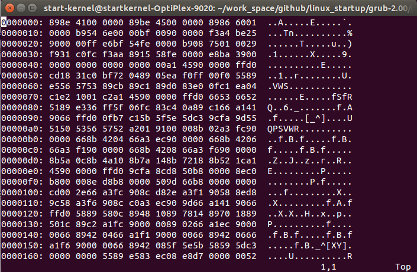

Decompress grub kernel: lzma decode
================================

Default compression algorithm of grub is lzma(Lempel–Ziv–Markov chain algorithm), This algorithm uses a dictionary compression scheme  and features a high compression ratio, so it is very suitable for embedded applications. Original compressed code located from address 0x8d30, destination address of decompressed code started from address 0x100000, ended at 0x10b7cf.

After decompression completed, the content of memory start from 0x100000 as followed screen shot



Initialize stack, reserve data area used in decompress procedure as follow:
```assembly
grub-core/boot/i386/pc/lzma_decode.S:82
#define now_pos         -4(%ebp)
#define prev_byte       -8(%ebp)
#define range           -12(%ebp)
#define code            -16(%ebp)
#define state           -20(%ebp)
#define rep0            -24(%ebp)
#define rep1            -28(%ebp)
#define rep2            -32(%ebp)
#define rep3            -36(%ebp)
```


Initialize every word with value saved in eax(0x400), address from edi(0x10b7d0), size of words stored in ecx(0x1f36), this area will be used soon in followed process. Next initialize now_pos, prev_byte, state with 0, rep0, rep1, rep2, rep3 with 1, range with 0xffffffff, code is initialized with bytes followed LOCAL(decompressor_end) label.
After above all completed, next get into lzma_decode_loop located at address 0x8b07.


```assembly
   0x8ac7:	push   %ebp
(gdb) info registers ebp
ebp            0x7fff0	0x7fff0
(gdb) x/w 0x7fff0
0x7fff0:	0x00100000
   0x8ac8:	mov    %esp,%ebp
(gdb) info registers esp
esp            0x7ffe8	0x7ffe8
(gdb) x/w 0x7ffe8
0x7ffe8:	0x000089e8
   0x8aca:	sub    $0x24,%esp
(gdb) info registers edi
edi            0x100000	1048576
   0x8acd:	push   %edi
   0x8ace:	cld    
(gdb) info registers ebx
ebx            0x10b7d0	1095632
   0x8acf:	mov    %ebx,%edi
   0x8ad1:	mov    $0x1f36,%ecx
   0x8ad6:	mov    $0x400,%eax
(gdb) info registers 
eax            0x400	1024
ecx            0x1f36	7990
edx            0xffffff90	-112
ebx            0x10b7d0	1095632
esp            0x7ffbc	0x7ffbc
ebp            0x7ffe4	0x7ffe4
esi            0x8d30	36144
edi            0x10b7d0	1095632
eip            0x8adb	0x8adb
eflags         0x6	[ PF ]
cs             0x8	8
ss             0x10	16
ds             0x10	16
es             0x10	16
fs             0x10	16
gs             0x10	16
   0x8adb:	rep stos %eax,%es:(%edi)
   0x8add:	pop    %edi
(gdb) info registers edi
edi            0x100000	1048576
   0x8ade:	xor    %eax,%eax
   0x8ae0:	mov    %eax,-0x4(%ebp)
   0x8ae3:	mov    %eax,-0x8(%ebp)
   0x8ae6:	mov    %eax,-0x14(%ebp)
   0x8ae9:	inc    %eax
(gdb) info registers eax
eax            0x1	1
   0x8aea:	mov    %eax,-0x18(%ebp)
   0x8aed:	mov    %eax,-0x1c(%ebp)
   0x8af0:	mov    %eax,-0x20(%ebp)
   0x8af3:	mov    %eax,-0x24(%ebp)
   0x8af6:	neg    %eax
(gdb) info registers eax
eax            0xffffffff	-1
   0x8af8:	mov    %eax,-0xc(%ebp)
   0x8afb:	inc    %eax
(gdb) info registers eax
eax            0x0	0
   0x8afc:	mov    $0x5,%cl
(gdb) x/g 0x8d30
0x8d30:	0x4db30cdf83a34400
   0x8afe:	shl    $0x8,%eax
   0x8b01:	lods   %ds:(%esi),%al
   0x8b02:	loop   0x8afe
   0x8b04:	mov    %eax,-0x10(%ebp)
(gdb) info registers eax
eax            0x44a383df	1151566815

-----------------------------------------------------------------------

grub-core/boot/i386/pc/lzma_decode.S:197

/*
 * int LzmaDecode(CLzmaDecoderState *vs,
 *                const unsigned char *inStream,
 *                unsigned char *outStream,
 *                SizeT outSize);
 */

_LzmaDecodeA:

        pushl   %ebp
        movl    %esp, %ebp
        subl    $LOCAL_SIZE, %esp

#ifndef ASM_FILE
        pushl   %esi
        pushl   %edi
        pushl   %ebx

        movl    %eax, %ebx
        movl    %edx, %esi
        pushl   %ecx
#else
        pushl   %edi
#endif

        cld

#ifdef FIXED_PROPS
        movl    %ebx, %edi
        movl    $(Literal + (LZMA_LIT_SIZE << (FIXED_LC + FIXED_LP))), %ecx
#else
        movl    $LZMA_LIT_SIZE, %eax
        movb    lc, %cl
        addb    lp, %cl
        shll    %cl, %eax
        addl    $Literal, %eax
        movl    %eax, %ecx
        movl    probs, %edi
#endif

        movl    $(kBitModelTotal >> 1), %eax

        rep
        stosl

        popl    %edi

        xorl    %eax, %eax
        movl    %eax, now_pos
        movl    %eax, prev_byte
        movl    %eax, state

        incl    %eax
        movl    %eax, rep0
        movl    %eax, rep1
        movl    %eax, rep2
        movl    %eax, rep3

#ifndef FIXED_PROPS
        movl    %eax, %edx
        movb    pb, %cl
        shll    %cl, %edx
        decl    %edx
        movl    %edx, pos_state_mask

        movl    %eax, %edx
        movb    lp, %cl
        shll    %cl, %edx
        decl    %edx
        movl    %edx, lit_pos_mask;
#endif

        /* RangeDecoderInit */
        negl    %eax
        movl    %eax, range

        incl    %eax
        movb    $5, %cl

1:
        shll    $8, %eax
        lodsb
        loop    1b

        movl    %eax, code
```


Before continue decompress process, let's check the value of out_size which defined together with now_pos etc... I didn't list it before because no assignment in grub source code, from debug information we can find the address of out_size located at 0x7ffec, yes, in the beginning of this chapter grub push ecx to stack, it stored decompressed size of core image(0xb7d0), defination of out_size as follow:
```assembly
grub-core/boot/i386/pc/lzma_decode.S:80

#define out_size        8(%ebp)
```

In lzma_decode_loop it first check whether now_pos exceeds out_size, if yes, it means decompress procedure completed, return and continue next step of grub intialization, if not, continue the decompress loop, jump to address 0x8b13.


```assembly
   0x8b07:	mov    -0x4(%ebp),%eax
(gdb) info registers ebp
ebp            0x7ffe4	0x7ffe4
(gdb) x/w 0x7ffe4+0x8
0x7ffec:	0x0000b7d0
   0x8b0a:	cmp    0x8(%ebp),%eax
   0x8b0d:	jb     0x8b13

-----------------------------------------------------------------------

grub-core/boot/i386/pc/lzma_decode.S:326

lzma_decode_loop:
        movl    now_pos, %eax
        cmpl    out_size, %eax

        jb      1f
```


The context before calling RangeDecoderBitDecode of below instructions block as follow, :

1. eax: 0x0, state: 0x00000000
2. eax: 0x1, state: 0x00000000
3. eax: 0x2, state: 0x00000000
4. eax: 0x3, state: 0x00000000
5. eax: 0x4, state: 0x00000000
6. eax: 0x6, state: 0x00000008


```assembly
   0x8b13:	and    $0x3,%eax
   0x8b16:	push   %eax
   0x8b17:	mov    -0x14(%ebp),%edx
   0x8b1a:	shl    $0x4,%edx
   0x8b1d:	add    %edx,%eax
   0x8b1f:	push   %eax
   0x8b20:	call   0x8a01
   0x8b25:	jb     0x8bc5
   0x8b2b:	mov    -0x4(%ebp),%eax
   0x8b2e:	and    $0x0,%eax

-----------------------------------------------------------------------

grub-core/boot/i386/pc/lzma_decode.S:344

1:
#ifdef FIXED_PROPS
        andl    $POS_STATE_MASK, %eax
#else
        andl    pos_state_mask, %eax
#endif
        pushl   %eax                            /* posState */
        movl    state, %edx
        shll    $kNumPosBitsMax, %edx
        addl    %edx, %eax
        pushl   %eax                            /* (state << kNumPosBitsMax) + posState */

        call    RangeDecoderBitDecode
```


Let's step into RangeDecoderBitDecode routine, grub initialized 0x1f36 words with 0x400 from memory address 0x10b7d0. Decompression will use this routine until complete, I will save context every time routine execution complete. Every bytes after LOCAL(decompressor_end) label are part of grub core code length, for example in the 9th record, when range is below 0x1000000, load one byte pointed by esi and update range.

1. eax: 0x0, address: 0x10b7d0 0x400 -> 0x420, range: 0xffffffff -> 0x7ffffc00, code: 0x44a383df, CF: 0
2. eax: 0x737, address: 0x10d4ac 0x400 -> 0x3e0, range: 0x7ffffc00 -> 0x40000000, code: 0x44a383df -> 0x04a387df, CF: 1
3. eax: 0x739, address: 0x10d4b4 0x400 -> 0x420, range: 0x40000000 -> 0x20000000, code: 0x04a387df, CF: 0
4. eax: 0x73c, address: 0x10d4c0 0x400 -> 0x420, range: 0x20000000 -> 0x10000000, code: 0x04a387df, CF: 0
5. eax: 0x742, address: 0x10d4d8 0x400 -> 0x420, range: 0x10000000 -> 0x8000000, code: 0x04a387df, CF: 0
6. eax: 0x74e, address: 0x10d508 0x400 -> 0x3e0, range: 0x8000000 -> 0x4000000, code: 0x04a387df -> 0x00a387df, CF: 1
7. eax: 0x767, address: 0x10d56c 0x400 -> 0x420, range: 0x4000000 -> 0x2000000, code: 0x00a387df, CF: 0
8. eax: 0x798, address: 0x10d630 0x400 -> 0x420, range: 0x2000000 -> 0x1000000, code: 0x00a387df, CF: 0
9. eax: 0x7fa, address: 0x10d7b8 0x400 -> 0x3e0, range: 0x1000000 -> 0x800000 -> 0x80000000, code: 0x00a387df -> 0x002387df -> 0x2387df0c, CF: 1
10. eax: 0x1, address: 0x10b7d4 0x400 -> 0x420, range: 0x80000000 -> 0x40000000, code: 0x2387df0c, CF: 0
11. eax: 0x1337, address: 0x1104ac 0x400 -> 0x3e0, range: 0x40000000 -> 0x20000000, code: 0x2387df0c -> 0x0387df0c, CF: 1
12. eax: 0x1339, address: 0x1104b4 0x400 -> 0x420, range: 0x20000000 -> 0x10000000, code: 0x0387df0c, CF: 0
13. eax: 0x133c, address: 0x1104c0 0x400 -> 0x420, range: 0x10000000 -> 0x8000000, code: 0x0387df0c, CF: 0
14. eax: 0x1342, address: 0x1104d8 0x400 -> 0x420, range: 0x8000000 -> 0x4000000, code: 0x0387df0c, CF: 0
15. eax: 0x134e, address: 0x110508 0x400 -> 0x3e0, range: 0x4000000 -> 0x2000000, code: 0x0387df0c -> 0x0187df0c, CF: 1
16. eax: 0x1367, address: 0x11056c 0x400 -> 0x3e0, range: 0x2000000 -> 0x1000000, code: 0x0187df0c -> 0x0087df0c, CF: 1
17. eax: 0x1399, address: 0x110634 0x400 -> 0x3e0, range: 0x1000000 -> 0x800000 -> 0x80000000, code: 0x0087df0c -> 0x0007df0c -> 0x07df0cb3, CF: 1
18. eax: 0x13fd, address: 0x1107c4 0x400 -> 0x420, range: 0x80000000 -> 0x40000000, code: 0x07df0cb3, CF: 0
19. eax: 0x1, address: 0x10b7d8 0x400 -> 0x420, range: 0x40000000 -> 0x20000000, code: 0x07df0cb3, CF: 0
20. eax: 0x1337, address: 0x1104ac 0x3e0 -> 0x401, range: 0x20000000 -> 0xf800000, code: 0x07df0cb3, CF: 0
21. eax: 0x1338, address: 0x1104b0 0x400 -> 0x3e0, range: 0xf800000 -> 0x7c00000, code: 0x001f0cb3, CF: 1
22. eax: 0x133b, address: 0x1104bc 0x400 -> 0x420, range: 0x7c00000 -> 0x3e00000, code: 0x001f0cb3, CF: 0
23. eax: 0x1340, address: 0x1104d0 0x400 -> 0x420, range: 0x3e00000 -> 0x1f00000, code: 0x001f0cb3, CF: 0
24. eax: 0x134a, address: 0x1104f8 0x400 -> 0x420, range: 0x1f00000 -> 0xf80000 -> 0xf8000000, code: 0x001f0cb3 -> 0x1f0cb34d, CF: 0
25. eax: 0x135e, address: 0x110548 0x400 -> 0x420, range: 0xf8000000 -> 0x7c000000, code: 0x1f0cb34d, CF: 0
26. eax: 0x1386, address: 0x1105e8 0x400 -> 0x420, range: 0x7c000000 -> 0x3e000000, code: 0x1f0cb34d, CF: 0
27. eax: 0x13d6, address: 0x110728 0x400 -> 0x3e0, range: 0x3e000000 -> 0x1f000000, code: 0x000cb34d, CF: 1
28. eax: 0x3, address: 0x10b7dc 0x400 -> 0x420, range: 0x1f000000 -> 0xf800000, code: 0x000cb34d, CF: 0
29. eax: 0xd37, address: 0x10ecac 0x400 -> 0x420, range: 0xf800000 -> 0x7c00000, code: 0x000cb34d, CF: 0
30. eax: 0xd38, address: 0x10ecb0 0x400 -> 0x420, range: 0x7c00000 -> 0x3e00000, code: 0x000cb34d, CF: 0
31. eax: 0xd3a, address: 0x10ecb8 0x400 -> 0x420, range: 0x3e00000 -> 0x1f00000, code: 0x000cb34d, CF: 0
32. eax: 0xd3e, address: 0x10ecc8 0x400 -> 0x420, range: 0x1f00000 -> 0xf80000 -> 0xf8000000, code: 0x000cb34d -> 0x0cb34d0d, CF: 0
33. eax: 0xd46, address: 0x10ece8 0x400 -> 0x420, range: 0xf8000000 -> 0x7c000000, code: 0x0cb34d0d, CF: 0
34. eax: 0xd56, address: 0x10ed28 0x400 -> 0x420, range: 0x7c000000 -> 0x3e000000, code: 0x0cb34d0d, CF: 0
35. eax: 0xd76, address: 0x10eda8 0x400 -> 0x420, range: 0x3e000000 -> 0x1f000000, code: 0x0cb34d0d, CF: 0
36. eax: 0xdb6, address: 0x10eea8 0x400 -> 0x420, range: 0x1f000000 -> 0xf800000, code: 0x0cb34d0d, CF: 0
37. eax: 0x0, address: 0x10b7d0 0x420 -> 0x3ff, range: 0xf800000 -> 0x7820000, code: 0x04b54d0d, CF: 1
38. eax: 0xc0, address: 0x10bad0 0x400 -> 0x3e0, range: 0x7820000 -> 0x3c10000, code: 0x00f44d0d, CF: 1
39. eax: 0xcc, address: 0x10bb00 0x400 -> 0x420, range: 0x3c10000 -> 0x1e08000, code: 0x00f44d0d, CF: 0
40. eax: 0xf0, address: 0x10bb90 0x400 -> 0x3e0, range: 0x1e08000 -> 0xf04000 -> 0xf0400000, code: 0x00040d0d -> 0x040d0dcf, CF: 1
41. eax: 0x534, address: 0x10cca0 0x400 -> 0x420, range: 0xf0400000 -> 0x78200000, code: 0x040d0dcf, CF: 0
42. eax: 0x537, address: 0x10ccac 0x400 -> 0x420, range: 0x78200000 -> 0x3c100000, code: 0x040d0dcf, CF: 0
43. eax: 0x538, address: 0x10ccb0 0x400 -> 0x420, range: 0x3c100000 -> 0x1e080000, code: 0x040d0dcf, CF: 0
44. eax: 0x53a, address: 0x10ccb8 0x400 -> 0x420, range: 0x1e080000 -> 0xf040000, code: 0x040d0dcf, CF: 0
45. eax: 0x82, address: 0x10b9d8 0x400 -> 0x420, range: 0xf040000 -> 0x7820000, code: 0x040d0dcf, CF: 0
46. eax: 0x837, address: 0x10d8ac 0x400 -> 0x3e0, range: 0x7820000 -> 0x3c10000, code: 0x040d0dcf -> 0x004c0dcf, CF: 1
47. eax: 0x739, address: 0x10d4b4 0x420 -> 0x43f, range: 0x3c10000 -> 0x01ef8400, code: 0x004c0dcf, CF: 0
48. eax: 0x73c, address: 0x10d4c0 0x420 -> 0x43f, range: 0x01ef8400 -> 0xff7e00 -> 0xff7e0000, code: 0x004c0dcf -> 0x4c0dcfb8, CF: 0
49. eax: 0x742, address: 0x10d4d8 0x420 -> 0x43f, range: 0xff7e0000 -> 0x83bcf800, code: 0x4c0dcfb8, CF: 0
50. eax: 0x74e, address: 0x10d508 0x3e0 -> 3c1, range: 0x83bcf800 -> 0x43ed6fe0, code: 0x4c0dcfb8 -> 0x0c3e4798, CF: 1

```assembly
   0x8a01:	lea    (%ebx,%eax,4),%eax
   0x8a04:	mov    %eax,%ecx
   0x8a06:	mov    (%ecx),%eax
   0x8a08:	mov    -0xc(%ebp),%edx
   0x8a0b:	shr    $0xb,%edx
   0x8a0e:	mul    %edx
   0x8a10:	cmp    -0x10(%ebp),%eax
   0x8a13:	jbe    0x8a3d
   0x8a15:	mov    %eax,-0xc(%ebp)
   0x8a18:	mov    $0x800,%edx
   0x8a1d:	sub    (%ecx),%edx
   0x8a1f:	shr    $0x5,%edx
   0x8a22:	add    %edx,(%ecx)
   0x8a24:	clc    
   0x8a25:	pushf  
   0x8a26:	cmpl   $0x1000000,-0xc(%ebp)
   0x8a2d:	jae    0x8a3b
   0x8a2f:	shll   $0x8,-0x10(%ebp)
   0x8a33:	lods   %ds:(%esi),%al
   0x8a34:	mov    %al,-0x10(%ebp)
   0x8a37:	shll   $0x8,-0xc(%ebp)
   0x8a3b:	popf   
   0x8a3c:	ret    
   0x8a3d:	sub    %eax,-0xc(%ebp)
   0x8a40:	sub    %eax,-0x10(%ebp)
   0x8a43:	mov    (%ecx),%edx
   0x8a45:	shr    $0x5,%edx
   0x8a48:	sub    %edx,(%ecx)
   0x8a4a:	stc    
   0x8a4b:	jmp    0x8a25

-----------------------------------------------------------------------

grub-core/boot/i386/pc/lzma_decode.S:117

RangeDecoderBitDecode:
#ifdef FIXED_PROPS
        leal    (%ebx, %eax, 4), %eax
#else
        shll    $2, %eax
        addl    probs, %eax
#endif

        movl    %eax, %ecx
        movl    (%ecx), %eax

        movl    range, %edx
        shrl    $kNumBitModelTotalBits, %edx
        mull    %edx

        cmpl    code, %eax
        jbe     1f

        movl    %eax, range
        movl    $kBitModelTotal, %edx
        subl    (%ecx), %edx
        shrl    $kNumMoveBits, %edx
        addl    %edx, (%ecx)
        clc
3:
        pushf
        cmpl    $kTopValue, range
        jnc     2f
        shll    $8, code
        lodsb
        movb    %al, code
        shll    $8, range
2:
        popf
        ret
1:
        subl    %eax, range
        subl    %eax, code
        movl    (%ecx), %edx
        shrl    $kNumMoveBits, %edx
        subl    %edx, (%ecx)
        stc
        jmp     3b
```

After returned from RangeDecoderBitDecode, now we are in _LzmaDecodeA routine again. Grub executes next instructions until jumps to 5f which located at address 0x8b87.

1. eflags: [ ], now_pos: 0x00000000, prev_byte: 0x00, eax: 0x736 pushed to stack, it's the value 0x8(%esp), rep0: 0x1, edi: 0x100000, matchByte: (0xfffff)0x0402016e value in address 0xfffff pushed to stack, state: 0x00
2. eflags: [ ], now_pos: 0x00000001, prev_byte: 0x89, eax: 0x1336, rep0: 0x1, edi: 0x100001, matchByte: (0x100000)0x89, state: 0x00
3. eflags: [ ], now_pos: 0x00000002, prev_byte: 0x8e, eax: 0x1336, rep0: 0x1, edi: 0x100002, matchByte: (0x100001)0x8e, state: 0x00
4. eflags: [ ], now_pos: 0x00000003, prev_byte: 0x41, eax: 0xd36, rep0: 0x1, edi: 0x100003, matchByte: (0x100002)0x41, state: 0x01
5. eflags: [ CF PF AF ] ... jump to 1f address 0x8bc5
6. eflags: [ ], now_pos: 0x00000006, prev_byte: 0x00, eax: 0x736, rep0: 0x1, edi: 0x100006, matchByte: (0x100005)0x00, state: 0x08, [0x8b62] esp: 0x7ffb0 0x0, [0x8b73] eax: 0x837

```assembly
   0x8b25:	jb     0x8bc5
   0x8b2b:	mov    -0x4(%ebp),%eax
   0x8b2e:	and    $0x0,%eax
   0x8b31:	shl    $0x3,%eax
   0x8b34:	mov    -0x8(%ebp),%edx
   0x8b37:	shr    $0x5,%edx
   0x8b3a:	add    %edx,%eax
   0x8b3c:	mov    $0x300,%edx
   0x8b41:	mul    %edx
   0x8b43:	add    $0x736,%eax
   0x8b48:	push   %eax
   0x8b49:	inc    %edx
   0x8b4a:	mov    -0x18(%ebp),%eax
   0x8b4d:	neg    %eax
   0x8b4f:	pushl  (%edi,%eax,1)                  //What is matchByte//
   0x8b52:	cmpb   $0x7,-0x14(%ebp)
   0x8b56:	jb     0x8b87
   0x8b58:	cmp    $0x100,%edx
   0x8b5e:	jae    0x8ba0
   0x8b60:	xor    %eax,%eax
   0x8b62:	shlb   (%esp)
   0x8b65:	adc    %eax,%eax
   0x8b67:	push   %eax
   0x8b68:	push   %edx
   0x8b69:	shl    $0x8,%eax
   0x8b6c:	lea    0x100(%edx,%eax,1),%eax
   0x8b73:	add    0xc(%esp),%eax
   0x8b77:	call   0x8a01
   0x8b7c:	setb   %al
   0x8b7f:	pop    %edx
   0x8b80:	adc    %edx,%edx
   0x8b82:	pop    %ecx
   0x8b83:	cmp    %cl,%al
   0x8b85:	je     0x8b58

-----------------------------------------------------------------------

grub-core/boot/i386/pc/lzma_decode.S:357

        jc      1f

        movl    now_pos, %eax

#ifdef FIXED_PROPS
        andl    $LIT_POS_MASK, %eax
        shll    $FIXED_LC, %eax
        movl    prev_byte, %edx
        shrl    $(8 - FIXED_LC), %edx
#else
        andl    lit_pos_mask, %eax
        movb    lc, %cl
        shll    %cl, %eax
        negb    %cl
        addb    $8, %cl
        movl    prev_byte, %edx
        shrl    %cl, %edx
#endif

        addl    %edx, %eax
        movl    $LZMA_LIT_SIZE, %edx
        mull    %edx
        addl    $Literal, %eax
        pushl   %eax

        incl    %edx                    /* edx = 1 */

        movl    rep0, %eax
        negl    %eax
        pushl   (%edi, %eax)            /* matchByte */

        cmpb    $kNumLitStates, state
        jb      5f
        
        /* LzmaLiteralDecodeMatch */

3:
        cmpl    $0x100, %edx
        jae     4f

        xorl    %eax, %eax
        shlb    $1, (%esp)
        adcl    %eax, %eax

        pushl   %eax
        pushl   %edx

        shll    $8, %eax
        leal    0x100(%edx, %eax), %eax
        addl    12(%esp), %eax
        call    RangeDecoderBitDecode

        setc    %al
        popl    %edx
        adcl    %edx, %edx

        popl    %ecx
        cmpb    %cl, %al
        jz      3b
```


Followed instructions will be executed not only once, same with RangeDecoderBitDecode routine. I will save contexts before calling RangeDecoderBitDecode, carry flag is the result from routine RangeDecoderBitDecode. When edx over 0x100, grub initialization jumps to 5f at address 0x8ba0,

1. edx: 0x1, 0x8(%esp): 0x736(result of eax added $Literal), eax: 0x737, CF: 1
2. edx: 0x3, 0x8(%esp): 0x736, eax: 0x739, CF: 0
3. edx: 0x6, 0x8(%esp): 0x736, eax: 0x73c, CF: 0
4. edx: 0xc, 0x8(%esp): 0x736, eax: 0x742, CF: 0
5. edx: 0x18, 0x8(%esp): 0x736, eax: 0x74e, CF: 1
6. edx: 0x31, 0x8(%esp): 0x736, eax: 0x767, CF: 0
7. edx: 0x62, 0x8(%esp): 0x736, eax: 0x798, CF: 0
8. edx: 0xc4, 0x8(%esp): 0x736, eax: 0x7fa, CF: 1
9. edx: 0x189, 0x8(%esp): ?, eax: ?, CF: ?
10. edx: 0x1, 0x8(%esp): 0x1336, eax: 0x1337, CF: 1
11. edx: 0x3, 0x8(%esp): 0x1336, eax: 0x1339, CF: 0
12. edx: 0x6, 0x8(%esp): 0x1336, eax: 0x133c, CF: 0
13. edx: 0xc, 0x8(%esp): 0x1336, eax: 0x1342, CF: 0
14. edx: 0x18, 0x8(%esp): 0x1336, eax: 0x134e, CF: 1
15. edx: 0x31, 0x8(%esp): 0x1336, eax: 0x1367, CF: 1
16. edx: 0x63, 0x8(%esp): 0x1336, eax: 0x1399, CF: 1
17. edx: 0xc7, 0x8(%esp): 0x1336, eax: 0x13fd, CF: 0
18. edx: 0x18e, 0x8(%esp): ?, eax: ?, CF: ?
19. edx: 0x1, 0x8(%esp): 0x1336, eax: 0x1337, CF: 0
20. edx: 0x2, 0x8(%esp): 0x1336, eax: 0x1338, CF: 1
21. edx: 0x5, 0x8(%esp): 0x1336, eax: 0x133b, CF: 0
22. edx: 0xa, 0x8(%esp): 0x1336, eax: 0x1340, CF: 0
23. edx: 0x14, 0x8(%esp): 0x1336, eax: 0x134a, CF: 0
24. edx: 0x28, 0x8(%esp): 0x1336, eax: 0x135e, CF: 0
25. edx: 0x50, 0x8(%esp): 0x1336, eax: 0x1386, CF: 0
26. edx: 0xa0, 0x8(%esp): 0x1336, eax: 0x13d6, CF: 1
27. edx: 0x141, 0x8(%esp): ?, eax: ?, CF: ?
28. edx: 0x1, 0x8(%esp): 0xd36, eax: 0xd37, CF: 0
29. edx: 0x2, 0x8(%esp): 0xd36, eax: 0xd38, CF: 0
30. edx: 0x4, 0x8(%esp): 0xd36, eax: 0xd3a, CF: 0
31. edx: 0x8, 0x8(%esp): 0xd36, eax: 0xd3e, CF: 0
32. edx: 0x10, 0x8(%esp): 0xd36, eax: 0xd46, CF: 0
33. edx: 0x20, 0x8(%esp): 0xd36, eax: 0xd56, CF: 0
34. edx: 0x40, 0x8(%esp): 0xd36, eax: 0xd76, CF: 0
35. edx: 0x80, 0x8(%esp): 0xd36, eax: 0xdb6, CF: 0
36. edx: 0x100, 0x8(%esp): ?, eax: ?, CF: ?
37. edx: 0x3, 0x8(%esp): 0x736, eax: 0x739, CF: 0
38. edx: 0x6, 0x8(%esp): 0x736, eax: 0x73c, CF: 0
39. edx: 0xc, 0x8(%esp): 0x736, eax: 0x742, CF: 0
40. edx: 0x18, 0x8(%esp): 0x736, eax: 0x74e, CF: 1


```assembly
   0x8b87:	cmp    $0x100,%edx
   0x8b8d:	jae    0x8ba0
   0x8b8f:	push   %edx
   0x8b90:	mov    %edx,%eax
   0x8b92:	add    0x8(%esp),%eax
   0x8b96:	call   0x8a01
   0x8b9b:	pop    %edx
   0x8b9c:	adc    %edx,%edx
   0x8b9e:	jmp    0x8b87
   0x8ba0:	add    $0x10,%esp

-----------------------------------------------------------------------

grub-core/boot/i386/pc/lzma_decode.S:417

5:

        /* LzmaLiteralDecode */

        cmpl    $0x100, %edx
        jae     4fc

        pushl   %edx
        movl    %edx, %eax
        addl    8(%esp), %eax
        call    RangeDecoderBitDecode
        popl    %edx
        adcl    %edx, %edx
        jmp     5b
```


Reserve new stack area for next stage decompression, write byte(0x8abf), not know the meaning of each state value. This block of instructions will be executed again and again in future, I record context of every time we get into following instructions.


1. esp: 0x7ffb0 -> 0x7ffc0, 0x7ffb4: 0x736, edx: 0x189, state: 0x00, jump to lzma_decode_loop(0x8b07)
2. esp: 0x7ffb0 -> 0x7ffc0, 0x7ffb4: 0x1336, edx: 0x18e, state: 0x00, jump to lzma_decode_loop(0x8b07)
3. esp: 0x7ffb0 -> 0x7ffc0, 0x7ffb4: 0x1336, edx: 0x141, state: 0x00, jump to lzma_decode_loop(0x8b07)
4. esp: 0x7ffb0 -> 0x7ffc0, 0x7ffb4: 0xd36, edx: 0x100, state: 0x00, jump to lzma_decode_loop(0x8b07)


```assembly
   0x8ba0:	add    $0x10,%esp
   0x8ba3:	mov    %dl,%al
   0x8ba5:	call   0x8abf
   0x8baa:	mov    -0x14(%ebp),%al
   0x8bad:	cmp    $0x4,%al
   0x8baf:	jae    0x8bb5
   0x8bb1:	xor    %al,%al
   0x8bb3:	jmp    0x8bbd
   0x8bb5:	sub    $0x3,%al
   0x8bb7:	cmp    $0x7,%al
   0x8bb9:	jb     0x8bbd
   0x8bbb:	sub    $0x3,%al
   0x8bbd:	mov    %al,-0x14(%ebp)
   0x8bc0:	jmp    0x8b07

-----------------------------------------------------------------------

grub-core/boot/i386/pc/lzma_decode.S:432

4:
        addl    $16, %esp

        movb    %dl, %al
        call    WriteByte

        movb    state, %al
        cmpb    $4, %al
        jae     2f
        xorb    %al, %al
        jmp     3f
2:
        subb    $3, %al
        cmpb    $7, %al
        jb      3f
        subb    $3, %al
3:
        movb    %al, state
        jmp     lzma_decode_loop
```

The context of WriteByte as follow

1. al: 0x89, prev_byte: 0x0 -> 0x89, 0x100000: 0x89, edi: 0x100000 -> 0x100001, now_pos: 0x00000000 -> 0x00000001
2. al: 0x8e, prev_byte: 0x89 -> 0x8e, 0x100001: 0x8e, edi: 0x100001 -> 0x100002, now_pos: 0x00000001 -> 0x00000002
3. al: 0x41, prev_byte: 0x8e -> 0x41, 0x100002: 0x41, edi: 0x100002 -> 0x100003, now_pos: 0x00000002 -> 0x00000003
4. al: 0x00, prev_byte: 0x41 -> 0x0, 0x100003: 0x0, edi: 0x100003 -> 0x100004, now_pos: 0x00000003 -> 0x00000004
5. al: 0x00, prev_byte: 0x0 -> 0x0, 0x100004: 0x0, edi: 0x100004 -> 0x100005, now_pos: 0x00000004 -> 0x00000005
6. al: 0x00, prev_byte: 0x0 -> 0x0, 0x100005: 0x0, edi: 0x100005 -> 0x100006, now_pos: 0x00000005 -> 0x00000006


```assembly
   0x8abf:	mov    %al,-0x8(%ebp)
   0x8ac2:	stos   %al,%es:(%edi)
   0x8ac3:	incl   -0x4(%ebp)
   0x8ac6:	ret

-----------------------------------------------------------------------

grub-core/boot/i386/pc/lzma_decode.S:234

WriteByte:
        movb    %al, prev_byte
        stosb
        incl    now_pos
        ret
```

It's a big block of instructions in lzma_decode.S, only context listed every time we get to here.

1. state: 0x0 -> 0x8, call 0x8a01 at 0x8bcd retured eflags: [ CF ], call 0x8a01 at 0x8be0 returned eflags: [ ], esp: 0x7ffb8 0x00000000, call 0x8a01 at 0x8bef returned eflags: [ CF ], jmp 0x8c6d, jmp 0x8d20, edx: 0x0 -> 0x2, jmp 0x8c09, rep0: 0x1, edi: 0x100004, [0x8c16:0x8c0e] edi: 100005

```assembly
   0x8bc5:	mov    -0x14(%ebp),%eax
   0x8bc8:	add    $0xc0,%eax
   0x8bcd:	call   0x8a01
   0x8bd2:	jae    0x8c72
   0x8bd8:	mov    -0x14(%ebp),%eax
   0x8bdb:	add    $0xcc,%eax
   0x8be0:	call   0x8a01
   0x8be5:	jb     0x8c1f
   0x8be7:	mov    (%esp),%eax
   0x8bea:	add    $0xf0,%eax
   0x8bef:	call   0x8a01
   0x8bf4:	jb     0x8c55
   0x8bf6:	cmpb   $0x7,-0x14(%ebp)
   0x8bfa:	movb   $0x9,-0x14(%ebp)
   0x8bfe:	jb     0x8c04
   0x8c00:	addb   $0x2,-0x14(%ebp)
   0x8c04:	mov    $0x1,%ecx
   0x8c09:	mov    -0x18(%ebp),%edx
   0x8c0c:	neg    %edx
   0x8c0e:	mov    (%edi,%edx,1),%al
   0x8c11:	call   0x8abf
   0x8c16:	loop   0x8c0e
   0x8c18:	pop    %eax
   0x8c19:	pop    %eax
   0x8c1a:	jmp    0x8b07
   0x8c1f:	mov    -0x14(%ebp),%eax
   0x8c22:	add    $0xd8,%eax
   0x8c27:	call   0x8a01
   0x8c2c:	mov    -0x1c(%ebp),%edx
   0x8c2f:	jae    0x8c4f
   0x8c31:	mov    -0x14(%ebp),%eax
   0x8c34:	add    $0xe4,%eax
   0x8c39:	call   0x8a01
   0x8c3e:	mov    -0x20(%ebp),%edx
   0x8c41:	jae    0x8c49
   0x8c43:	mov    -0x20(%ebp),%edx
   0x8c46:	xchg   %edx,-0x24(%ebp)
   0x8c49:	pushl  -0x1c(%ebp)
   0x8c4c:	popl   -0x20(%ebp)
   0x8c4f:	xchg   %edx,-0x18(%ebp)
   0x8c52:	mov    %edx,-0x1c(%ebp)
   0x8c55:	mov    $0x534,%eax
   0x8c5a:	call   0x8a79
   0x8c5f:	cmpb   $0x7,-0x14(%ebp)
   0x8c63:	movb   $0x8,-0x14(%ebp)
   0x8c67:	jb     0x8c6d
   0x8c69:	addb   $0x3,-0x14(%ebp)
   0x8c6d:	jmp    0x8d20
   0x8c72:	mov    -0x18(%ebp),%eax
   0x8c75:	xchg   %eax,-0x1c(%ebp)
   0x8c78:	xchg   %eax,-0x20(%ebp)
   0x8c7b:	mov    %eax,-0x24(%ebp)
   0x8c7e:	cmpb   $0x7,-0x14(%ebp)
   0x8c82:	movb   $0x7,-0x14(%ebp)
   0x8c86:	jb     0x8c8c
   0x8c88:	addb   $0x3,-0x14(%ebp)
   0x8c8c:	mov    $0x332,%eax
   0x8c91:	call   0x8a79
   0x8c96:	push   %edx

-----------------------------------------------------------------------

grub-core/boot/i386/pc/lzma_decode.S:452

1:
        movl    state, %eax
        addl    $IsRep, %eax
        call    RangeDecoderBitDecode
        jnc     1f

        movl    state, %eax
        addl    $IsRepG0, %eax
        call    RangeDecoderBitDecode
        jc      10f

        movl    (%esp), %eax
        addl    $IsRep0Long, %eax
        call    RangeDecoderBitDecode
        jc      20f

        cmpb    $7, state
        movb    $9, state
        jb      100f
        addb    $2, state
100:

        movl    $1, %ecx

3:
        movl    rep0, %edx
        negl    %edx

4:
        movb    (%edi, %edx), %al
        call    WriteByte
        loop    4b

        popl    %eax
        popl    %eax
        jmp     lzma_decode_loop

10:
        movl    state, %eax
        addl    $IsRepG1, %eax
        call    RangeDecoderBitDecode
        movl    rep1, %edx
        jnc     100f

        movl    state, %eax
        addl    $IsRepG2, %eax
        call    RangeDecoderBitDecode
        movl    rep2, %edx
        jnc     1000f
        movl    rep2, %edx
        xchgl   rep3, %edx
1000:
        pushl   rep1
        popl    rep2
100:
        xchg    rep0, %edx
        movl    %edx, rep1
20:

        movl    $RepLenCoder, %eax
        call    LzmaLenDecode

        cmpb    $7, state
        movb    $8, state
        jb      100f
        addb    $3, state
100:
        jmp     2f

1:
        movl    rep0, %eax
        xchgl   rep1, %eax
        xchgl   rep2, %eax
        movl    %eax, rep3

        cmpb    $7, state
        movb    $7, state
        jb      10f
        addb    $3, state
10:

        movl    $LenCoder, %eax
        call    LzmaLenDecode
        pushl   %edx

        movl    $(kNumLenToPosStates - 1), %eax
        cmpl    %eax, %edx
        jbe     100f
        movl    %eax, %edx
100:
        movb    $kNumPosSlotBits, %cl
        shll    %cl, %edx
        leal    PosSlot(%edx), %eax
        call    RangeDecoderBitTreeDecode

        movl    %edx, rep0
        cmpl    $kStartPosModelIndex, %edx
        jb      100f

        movl    %edx, %ecx
        shrl    $1, %ecx
        decl    %ecx

        movzbl  %dl, %eax
        andb    $1, %al
        orb     $2, %al
        shll    %cl, %eax
        movl    %eax, rep0

        cmpl    $kEndPosModelIndex, %edx
        jae     200f
        movl    rep0, %eax
        addl    $(SpecPos - 1), %eax
        subl    %edx, %eax
        jmp     300f
200:

        subb    $kNumAlignBits, %cl

        /* RangeDecoderDecodeDirectBits */
        xorl    %edx, %edx

1000:
        shrl    $1, range
        shll    $1, %edx

        movl    range, %eax
        cmpl    %eax, code
        jb      2000f
        subl    %eax, code
        orb     $1, %dl
2000:

        cmpl    $kTopValue, %eax
        jae     3000f
        shll    $8, range
        shll    $8, code
        lodsb
        movb    %al, code

3000:
        loop    1000b

        movb    $kNumAlignBits, %cl
        shll    %cl, %edx
        addl    %edx, rep0

        movl    $Align, %eax

300:
        call    RangeDecoderReverseBitTreeDecode
        addl    %ecx, rep0

100:
        incl    rep0
        popl    %edx

2:

        addl    $kMatchMinLen, %edx
        movl    %edx, %ecx

        jmp     3b

```


1. [0x8c5a:	call   0x8a79] eax: 0x534, call 0x8a01 at 0x8a7d retured eflags: [ ], esp: 0x7ffb0 -> 0x7ffb0+0xc = 0x0, 

```assembly
   0x8a79:	push   %eax
   0x8a7a:	add    $0x0,%eax
   0x8a7d:	call   0x8a01
   0x8a82:	pop    %eax
   0x8a83:	jb     0x8a9d
   0x8a85:	push   $0x0
   0x8a87:	mov    $0x3,%cl
   0x8a89:	add    $0x2,%eax
   0x8a8c:	mov    0xc(%esp),%edx
   0x8a90:	shl    %cl,%edx
   0x8a92:	add    %edx,%eax
   0x8a94:	call   0x8a4d
   0x8a99:	pop    %eax
   0x8a9a:	add    %eax,%edx
   0x8a9c:	ret    
   0x8a9d:	push   %eax
   0x8a9e:	add    $0x1,%eax
   0x8aa1:	call   0x8a01
   0x8aa6:	pop    %eax
   0x8aa7:	jb     0x8ab4
   0x8aa9:	push   $0x8
   0x8aab:	mov    $0x3,%cl
   0x8aad:	add    $0x82,%eax
   0x8ab2:	jmp    0x8a8c
   0x8ab4:	push   $0x10
   0x8ab6:	add    $0x102,%eax
   0x8abb:	mov    $0x8,%cl
   0x8abd:	jmp    0x8a94

-----------------------------------------------------------------------

grub-core/boot/i386/pc/lzma_decode.S:197

LzmaLenDecode:
        pushl   %eax
        addl    $LenChoice, %eax
        call    RangeDecoderBitDecode
        popl    %eax
        jc      1f
        pushl   $0
        movb    $kLenNumLowBits, %cl
        addl    $LenLow, %eax
2:
        movl    12(%esp), %edx
        shll    %cl, %edx
        addl    %edx, %eax
3:

        call    RangeDecoderBitTreeDecode
        popl    %eax
        addl    %eax, %edx
        ret

1:
        pushl   %eax
        addl    $LenChoice2, %eax
        call    RangeDecoderBitDecode
        popl    %eax
        jc      1f
        pushl   $kLenNumLowSymbols
        movb    $kLenNumMidBits, %cl
        addl    $LenMid, %eax
        jmp     2b
1:
        pushl   $(kLenNumLowSymbols + kLenNumMidSymbols)
        addl    $LenHigh, %eax
        movb    $kLenNumHighBits, %cl
        jmp     3b

````


1. ecx : 0x10cc03, eax: 0x536, 1st call 0x8a01 at 0x8a5a retured eflags: [ ], esp: 0x7ffa4 0x00000001 -> 0x00000002, 2nd call 0x8a01 at 0x8a5a retured eflags: [ ], esp: 0x7ffa4 0x00000002 -> 0x00000004, 3rd call 0x8a01 at 0x8a5a retured eflags: [ ], esp: 0x7ffa4 0x00000004 -> 0x00000008

```assembly
   0x8a4d:	movzbl %cl,%ecx
   0x8a50:	xor    %edx,%edx
   0x8a52:	push   %edx
   0x8a53:	inc    %edx
   0x8a54:	push   %edx
   0x8a55:	push   %eax
   0x8a56:	push   %ecx
   0x8a57:	push   %edx
   0x8a58:	add    %edx,%eax
   0x8a5a:	call   0x8a01
   0x8a5f:	pop    %edx
   0x8a60:	pop    %ecx
   0x8a61:	jae    0x8a6c
   0x8a63:	mov    0x4(%esp),%eax
   0x8a67:	or     %eax,0x8(%esp)
   0x8a6b:	stc    
   0x8a6c:	adc    %edx,%edx
   0x8a6e:	pop    %eax
   0x8a6f:	shll   (%esp)
   0x8a72:	loop   0x8a55
   0x8a74:	pop    %ecx
   0x8a75:	sub    %ecx,%edx
   0x8a77:	pop    %ecx
   0x8a78:	ret    


-----------------------------------------------------------------------

grub-core/boot/i386/pc/lzma_decode.S:197

RangeDecoderBitTreeDecode:
RangeDecoderReverseBitTreeDecode:
        movzbl  %cl, %ecx
        xorl    %edx, %edx
        pushl   %edx
        incl    %edx
        pushl   %edx

1:
        pushl   %eax
        pushl   %ecx
        pushl   %edx

        addl    %edx, %eax
        call    RangeDecoderBitDecode

        popl    %edx
        popl    %ecx

        jnc     2f
        movl    4(%esp), %eax
        orl     %eax, 8(%esp)
        stc

2:
        adcl    %edx, %edx
        popl    %eax

        shll    $1, (%esp)
        loop    1b

        popl    %ecx
        subl    %ecx, %edx              /* RangeDecoderBitTreeDecode */
        popl    %ecx                    /* RangeDecoderReverseBitTreeDecode */
        ret
```

Links:
------------------------------------
  * [Intel Opcode and Instruction](http://ref.x86asm.net/coder32.html)
  * [LZMA](https://en.wikipedia.org/wiki/Lempel%E2%80%93Ziv%E2%80%93Markov_chain_algorithm)
  * [LZMA SDK](http://www.7-zip.org/sdk.html)